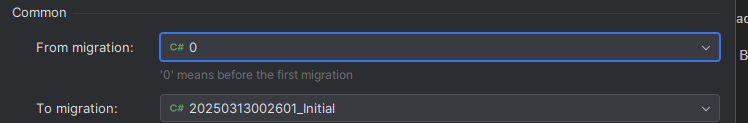

# Usando o Entity Framework

O EF é um ORM (similar ao Hibernate no Java).

Para criar uma migration: 
Botão direito no projeto > Entity Framework Core > Add Migration

Para gerar o script SQL a partir da migration:
Botão direito no projeto > Entity Framework Core > Generate SQL Script

Para executar a migration:
Botão direito no projeto > Entity Framework Core > Update Database

**IMPORTANTE:** necessário instalar o .NET SDK e o CLI dotnet-ef